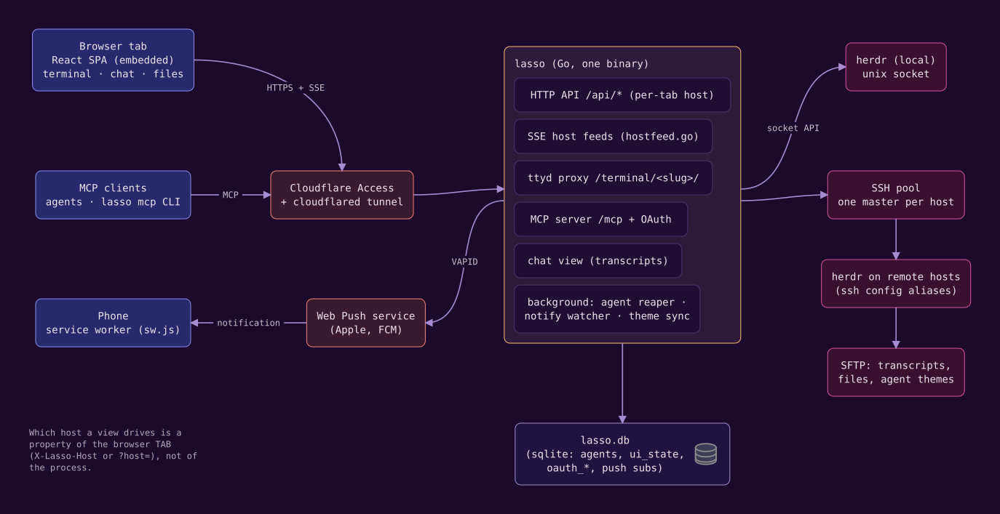

lasso adds a browser UI, an MCP surface and phone notifications around [herdr](https://herdr.dev). It does not replace herdr or sit in front of it: the terminal you see is your real herdr session, and anything lasso does to it (creating a workspace, focusing a pane, starting an agent) goes through herdr's own socket API. A handful of ideas explain the rest.

## herdr is the source of truth

herdr organizes terminals as **workspaces**, which hold **tabs**, which hold **panes**. An agent is a CLI (Claude Code, Codex, ...) running in a pane, and herdr tracks whether it is working, idle or blocked. lasso reads all of that from herdr and shows it; when you close a pane in herdr, lasso notices. lasso can also message an agent and collect its reply (`send_agent`, `get_replies`), which works from anywhere `/mcp` reaches, including claude.ai.

## Hosts

lasso runs on one machine but can drive herdr on any machine you can `ssh` to. Each ssh-config alias that answers with a compatible herdr is a **host**. The choice of host belongs to a **browser tab**: two tabs can sit on two machines at once. The sidebar goes further and follows the machine the focused pane is actually working on, even when that pane is an ssh window onto another box. See [Hosts](./hosts.md).

## Agents

lasso's **New** dialog and its `create_agent` MCP tool turn "make a worktree, open a workspace, start Claude in it with this prompt" into one step, on any host. lasso keeps a **record** of each agent it creates (host, repo, branch, harness, model, prompt) and retires the record when herdr's pane is gone. herdr panes lasso did not create still show up, just without a record. See [Agents](./agents.md).

## The shared browser

lasso can run a real Chromium on its own machine that you watch and click in from the sidebar's Browser tab, while your agents drive the same pages over the Chrome DevTools Protocol or the `/browser-mcp` MCP server. Profiles give it separate logins, and a profile can be a remote browser lasso dials. See [The shared browser](./shared-browser.md).

## Notifications

An agent blocked on a tool approval does nothing until someone answers. lasso watches every reachable host for that, and agents can also ping you deliberately with `lasso notify`. Both arrive as Web Push on registered devices, including a locked phone. See [Notifications](./notifications.md).

## Where state lives

lasso keeps its own state in `~/.lasso/` on the machine it runs on: `lasso.db` (settings, agent records, push devices, UI preferences), the shared browser's profiles, and the worktrees and scratch directories of agents it created locally. Agents created on another host get their worktrees under that host's `~/.lasso/`, and each host's creator settings live in that host's own `~/.lasso/lasso.db`. [Files and directories](../reference/files.md) lists everything.

UI preferences such as the theme, the appearance mode and the sidebar layout are stored on the server, not in the browser, so every browser on the same lasso agrees.

## Trust model in one paragraph

Whoever can reach lasso can type into a shell as you, read and write any file you can, spawn agents and drive a logged-in browser. lasso therefore binds to loopback by default, refuses a public bind without authentication, and expects to be reached over a private network or behind an authenticating edge such as Cloudflare Access. [Security](../security.md) covers the model in full.
