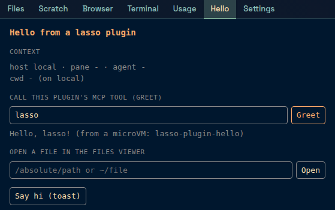

A plugin is a directory with a `plugin.json` manifest. It can add any mix of four things:

- **Sidebar tabs**: a web page of its own, in the sidebar strip next to Files and Browser.
- **MCP tools**: tools on lasso's `/mcp` server, named `<plugin>__<tool>`, so every agent connected to lasso can call them, and so can `lasso mcp`.
- **Themes**: Omarchy-format palettes that join the theme picker like any other theme.
- **Fonts**: font files that become choices in Settings → Themes → Typography.



This page is about installing and running plugins. To write one, see [Writing a plugin](./authoring.md).

## Try one

The lasso repository ships two examples. `hello` has a tab and one MCP tool; `harbor` has a theme and a font.

```bash
lasso plugin install execution-associates/lasso/examples/plugins/hello
lasso mcp hello__greet --name you
```

`install` shows exactly what the plugin asks for, then asks before installing and enabling it. `hello`'s MCP server runs in a microVM, so it needs microsandbox (below); its tab works without it.

## The trust model

A manifest is written by whoever wrote the plugin, so nothing in it can grant itself anything. Three rules follow from that.

**Nothing runs until you enable it.** A new plugin is disabled. Enabling it shows you its permissions and approves exactly those: its tabs' pages and URLs, the container image and command of its MCP server, the network hosts that server may reach, the names of its environment variables, which secret may be sent to which host, and its theme and font ids. lasso stores a fingerprint of that set in its own database. If a later edit to the manifest changes any of it, the plugin reads **needs approval** and its tabs and MCP server stop loading until you approve the new set. Edits that are not permissions (the version, the description, a label or icon, a palette) take effect without asking. lasso rescans the plugins directory every 10 seconds, so edits are noticed without a reload.

**Its MCP server runs in a microVM.** By default lasso runs a plugin's server inside a [microsandbox](https://github.com/microsandbox/microsandbox) microVM: its own kernel, the plugin directory mounted read-only, one writable data directory, nothing else from your machine, and no network except the hosts it listed. Secrets never enter the guest: msb substitutes the real value only in traffic to that secret's approved hosts. **Trusted** runs the server directly on your machine as your user instead. That flag is yours alone to set; no manifest field can set it. Even a trusted server gets a minimal environment and never sees lasso's own credentials.

**Its tabs cannot call lasso.** A tab's page is served as an opaque, sandboxed origin, so it cannot use your session to reach lasso's API (whose file endpoints can read and write anything you can). What a tab can do goes through a small message bridge: read the focused pane and the theme, open a file in the viewer, call its own plugin's tools, and show a toast. A tab that frames an outside URL gets no bridge at all.

### microsandbox

Sandboxed plugins need the `msb` CLI on lasso's machine. lasso finds it through `LASSO_MSB` (a path or a `PATH` name), then `msb` on `PATH`, then `~/.microsandbox/bin/msb`, which covers a systemd unit whose `PATH` lacks your shell's additions. `LASSO_MSB=off` disables sandboxed plugins. Without msb, tabs, themes and fonts still work, and each untrusted MCP server reads `unavailable` until msb is installed and you restart it. The Plugins group in Settings shows which msb lasso found, or why it found none.

A sandboxed server takes a couple of seconds to boot, and the first boot of an image also pulls it.

## Installing

There are three ways to get a plugin into `~/.lasso/plugins/` (or `$LASSO_DIR/plugins/`):

**From GitHub.** The source is `owner/repo`, `owner/repo/sub/dir`, or a `https://github.com/owner/repo/tree/<ref>/<subdir>` URL. Only GitHub is supported.

```bash
lasso plugin install owner/repo[/subdir] [--ref v1.2] [--no-enable] [-y]
```

lasso shallow-clones the repository into a hidden staging directory, with git hooks off and submodules skipped, refuses anything over 50 MB or 5000 files or with a symlink pointing outside the plugin, and validates the manifest. Then it shows every permission, the source and the exact commit, and asks. "Install and enable" approves exactly what the preview showed; if the staged files changed in between, the confirm is refused. `--no-enable` installs it disabled. Without a terminal, `install` refuses unless you pass `-y`. lasso records the source, ref and commit.

**Linked.** Use a checkout where it is, without copying it. This is how you develop a plugin.

```bash
lasso plugin link ~/src/my-plugin [--enable]
lasso plugin unlink my-plugin        # forgets the link; files untouched
```

**By hand.** Copy a plugin directory into the plugins directory, then enable it. The directory name must equal the manifest's `name`.

```bash
cp -r my-plugin ~/.lasso/plugins/
lasso plugin enable my-plugin
```

A name belongs to one plugin: install and link refuse a name that is already installed, linked or hand-placed.

### Finding plugins

Public plugins carry the GitHub topic **`lasso-plugin`**. Anyone can apply a topic to their own repository, and nobody reviews it, so it is a way to find plugins, not a catalog that vouches for them. What keeps you safe is the approval and the microVM, so read the permissions before you approve.

## Managing plugins

```bash
lasso plugin list [-json]           # state, trust, MCP status, source, tools
lasso plugin enable <name>          # prints the permissions it approves
lasso plugin disable <name>         # unload and withdraw the approval
lasso plugin trust <name>           # run its MCP server on the host
lasso plugin untrust <name>         # back into the microVM
lasso plugin restart <name>         # restart its MCP server
lasso plugin reload                 # rescan the plugins directory
lasso plugin update <name> [-y]     # re-fetch a GitHub install
lasso plugin uninstall <name> [--purge-data]
lasso plugin log <name> [-n 200] [-f]
lasso plugin data-dir <name>
```

These talk to the running lasso (through `LASSO_URL` or `LASSO_LISTEN`, sending `UI_AUTH` if set), because enabling a plugin starts a process only the server can own. The full flag list is in the [CLI reference](../reference/cli.md#lasso-plugin).

- **States.** A plugin is `disabled`, `enabled`, `needs_approval` (its permissions changed since you approved them) or `invalid` (a broken manifest, a missing linked path, a lasso too old for it, or the wrong OS, with the reason shown).
- **MCP status.** An enabled plugin's server is `starting`, `running`, `stopped`, `error` or `unavailable`. A server that dies is restarted with backoff. `unavailable` means a retry would not help (no msb, or a secret that did not resolve): fix the cause, then restart it.
- **Update** re-fetches a GitHub install's recorded source and ref, shows the new commit, and says whether the permissions change. Unchanged permissions keep their approval; changed ones read `needs_approval` until you approve them. If swapping the new files in fails, the old ones are put back.
- **Uninstall** removes a GitHub install and forgets its approval and trust. It works on GitHub installs only. A linked plugin is removed with `unlink`, and a hand-placed one is never deleted by lasso: delete its directory yourself.
- **Trust** survives a disable. Changing it restarts the server, since a server cannot move between the microVM and the host in place.

### In Settings

Settings → General → **Plugins** does the same from the browser: install from GitHub (with the same permission preview), enable, disable, trust, restart, update, uninstall, view logs, and see each server's MCP status. A plugin waiting for approval shows in the group's header in a warning colour, even while the group is closed. Enabling shows the permissions in a dialog first, and approves the exact set that dialog showed: if the manifest changed while you were reading, the approval is refused.

Settings → General → **Sidebar & usage** arranges the sidebar strip: which tabs show and in what order, built-in and plugin tabs alike. Settings itself cannot be hidden. The layout is stored on the server, so every browser on the same lasso follows it, and a disabled plugin's tab returns to its place when you enable it again.


## Themes and fonts

Themes and fonts are data, never CSS. A plugin cannot ship a stylesheet, because CSS that could restyle lasso could also hide the warnings in the approval dialog. It supplies values, and lasso writes every line of CSS itself.

- **A plugin theme** joins the same registry as lasso's own themes: it can be herdr's theme or an appearance palette, paints the chrome and the terminals, is written into the agent CLIs' theme files, syncs across the fleet, and its wallpapers show in the background gallery. It never replaces an existing theme: if its id is already taken, that theme is skipped with a warning and the rest of the plugin loads.
- **A plugin font** becomes a choice in Settings → Themes → Typography, for the interface, display headings, labels, code, or the terminal (the last two offer monospace fonts only). The terminal keeps its Nerd Font as a fallback, so TUI icons still render.

Disabling the plugin withdraws its themes and fonts; selections naming them fall back to the defaults, and come back when you enable it again.

```bash
lasso plugin install execution-associates/lasso/examples/plugins/harbor
```

## Data and logs

A plugin cannot write to its own directory. Its one writable place is `~/.lasso/plugin-data/<name>/` (mode 0700), mounted at `/data` in the microVM, with `LASSO_PLUGIN_DATA` pointing at it. An update replaces the plugin directory but leaves the data directory alone, and uninstall keeps it unless you pass `--purge-data`. `lasso plugin data-dir <name>` prints the path.

`lasso plugin log <name>` (or the Logs button in Settings) shows a server's recent output; `-f` follows it. A microVM's output does not stream into lasso's own log, so this is the place to look when a sandboxed server fails. A trusted server's last 500 lines are kept in memory.
