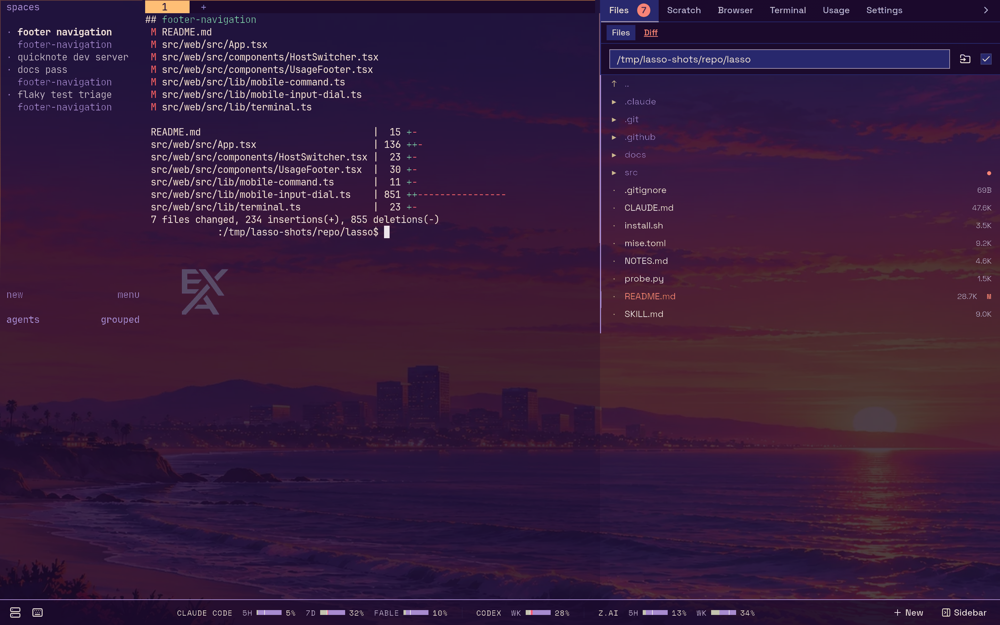
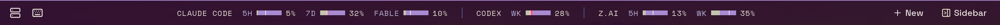
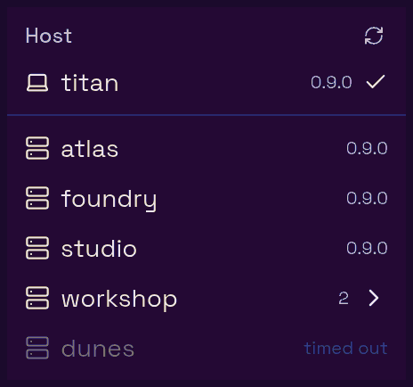
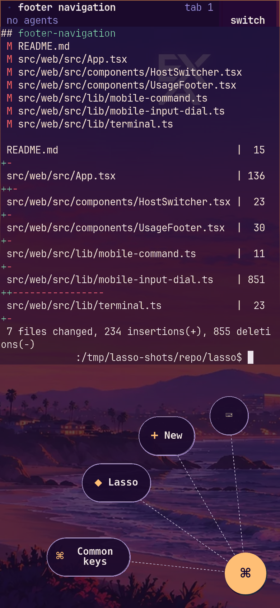

lasso's interface is one page with two columns and a footer. The left column is your real herdr session; the right column is a sidebar of tools that follow whichever pane herdr has focused. Everything you change in the sidebar's layout, the theme or the backdrop is stored on the lasso server, so every browser pointed at the same lasso shows the same thing.

## The terminal column

The left column is herdr itself, served by `ttyd`. Anything you type goes to herdr's focused pane, and other browsers on the same lasso see the same session. There is no header bar over it: lasso adds controls around the terminal, never on top of it. See [The terminal](./terminal.md).

The footer's view menu (it names the view you are in) switches what fills this column. Besides the terminal it offers three views that cover the terminal without unmounting it:

- **Chat** renders the focused agent's session as a conversation with a composer to reply. `⌘J` toggles it.
- **Grid** lays out every agent lasso can reach as a grid of cards, one transcript per card, grouped by machine. `⌘E` toggles it.
- **Bots** lists lasso's long-lived Claude Code sessions like a messaging app, with each bot's conversation and settings. See [Bots](./bots.md).

Chat and the Grid are described in [The terminal](./terminal.md#chat-view). Below them the menu lists any views your [plugins](../plugins/index.md) add. On a phone the input dial's **Chat** button opens the same picker.

## The sidebar

The right column holds the built-in tabs **Files** (with its **Diff** view), **Scratch**, **Browser**, **Terminal**, **Usage** and **Settings**, plus **Agents** on narrow screens and any tabs your [plugins](../plugins/index.md) add. Each one is covered in [The sidebar](./sidebar.md).

- Drag the handle between the columns to resize it. The sidebar can be collapsed entirely.
- `⌘\` or the footer's **Sidebar** button shows and hides it.
- The open/closed state and the width are shared by every browser on this lasso. The terminal is one shared session sized to fit, so browsers that disagreed about the sidebar's width would leave a blank gutter in one of them.
- Which tabs appear and in what order is set in **Settings → General → Sidebar & usage**. See [Arranging the tabs](./sidebar.md#arranging-and-hiding-tabs).

## The footer

At desktop widths (768 px and wider) a single footer row runs along the bottom. It is always there and has no setting to hide it, because it is the only pointer route to these controls. From left to right:

| Control | What it does |
| --- | --- |
| Left sidebar toggle | In the terminal, toggles herdr's own sidebar (it sends herdr's `prefix` + `b` chord). In Chat, shows or hides lasso's agent list. Disabled in the Grid and Bots. `⌘B`. |
| **Switch host** (server icon) | Opens the host menu: the local machine, every reachable alias from your SSH config with its herdr version and any update or set-up action, and lasso's own version. Picking a host moves this browser tab to it. See [Hosts](../concepts/hosts.md). |
| **Keyboard shortcuts** (keyboard icon) | Opens the shortcut reference. `⌘/`. |
| Usage | Each tracked provider's quota windows. They scroll inside their own track, so a long list never pushes the buttons offscreen. See [Usage](./sidebar.md#usage). |
| **Grid** | Switches the left column to the Grid, and back (the button then reads **Terminal**). `⌘E`. |
| **Chat** | Switches the left column to the chat view, and back (the button then reads **Terminal**). `⌘J`. |
| **New** | Opens the [New dialog](./new-agent.md) on its Agent form. `⌘O` opens it on Agent, `⌘I` on Terminal. |
| **Sidebar** | Shows or hides the right sidebar. While it is collapsed, the button carries the working tree's git status badge so you can still see it. `⌘\`. |

A host that is not answering says so in the host menu rather than holding up the list:

## On a phone

Below 768 px wide (a phone, or a desktop window dragged narrow) the layout changes:

- The footer is gone and the terminal gets the whole screen.
- The **input dial** in the terminal's bottom-right corner takes over the footer's job: New, Chat, the host menu, the sidebar, herdr's pane search and the keys a touch keyboard lacks. See [The input dial](./terminal.md#the-input-dial-phones-and-narrow-windows).
- An open sidebar covers the whole screen. Close it with the panel button at the right end of its tab strip.
- The sidebar gains an **Agents** tab, first in the strip, listing every agent across your hosts. Picking one closes the sidebar and opens that agent in the chat view. At desktop widths the same list is the chat's docked left column instead, so the tab is not shown there.
- The usage footer is not shown; the **Usage** sidebar tab has the same numbers.

Adding lasso to your home screen, HTTPS, and enabling notifications are covered in [Using lasso on a phone](../getting-started/phone.md).

## The first-run tour

The first time anyone opens a lasso, a short tour walks through the interface. It spotlights each control in turn and lets you try the ones that change a view in place (the view menu, the sidebar tabs). Use `←` and `→` to move and `Esc` to skip.

On a desktop it covers the terminal, **New**, the view menu, the host menu, the sidebar and the shortcut reference. On a phone it covers the terminal and the input dial, since the footer controls do not exist there.

Finishing or skipping the tour is recorded on the server, so it does not reappear in other browsers. Replay it from **Settings → General → Take the tour**.

## Keyboard shortcuts

`⌘/` (or the footer's keyboard button) shows this list in the app.

Every app shortcut uses the `⌘` key only, never `Ctrl`, so none of them collide with terminal control keys such as `Ctrl-H`. They work even while a terminal has keyboard focus: the terminal frames pass `⌘` chords up to the app. On Windows and Linux `⌘` is the Meta key (the Windows or Super key), which some desktops reserve for themselves.

### Anywhere

| Keys | Action |
| --- | --- |
| `⌘K` | In the terminal, opens herdr's own pane search (the same as herdr's `Ctrl-B g`). In Chat, opens a fleet-wide agent picker instead; in the Grid and Bots, focuses the view's own search box. |
| `⌘O` | New agent |
| `⌘I` | New terminal (from Chat, returns to the terminal first) |
| `⌘/` | Toggle the keyboard shortcut reference |

### Views

| Keys | Action |
| --- | --- |
| `⌘J` | Chat ⟷ terminal |
| `⌘E` | Grid ⟷ terminal |
| `⌘B` | Left sidebar: herdr's in the terminal, the agent list in Chat |
| `⌘\` | Toggle the right sidebar |
| `⌘⇧F` | Open the sidebar on Files |
| `⌘⇧S` | Open the sidebar on Scratch |
| `⌘⇧B` | Open the sidebar on Browser |

### In context

| Keys | Where | Action |
| --- | --- | --- |
| `⌘↩` | Chat composer | Send. A bare `↩` breaks the line. |
| `⌘↩` (or `Ctrl↩`) | Scratch | Send the buffer to the terminal |
| `⌘↩` (or `Ctrl↩`) | New dialog | Create |
| `⌘S` (or `Ctrl-S`) | File viewer | Save |
| `Esc` | File viewer | Close |

In the Grid, each card's composer sends on `↩` and breaks the line on `⇧↩`.

When the Browser tab's Agent mode has focus, it forwards keys to the page except the app shortcuts above, which still reach lasso.
