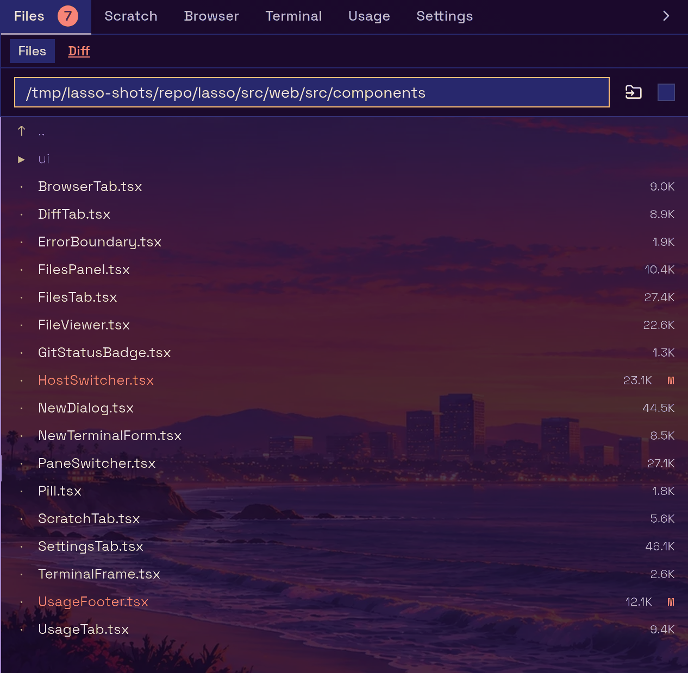
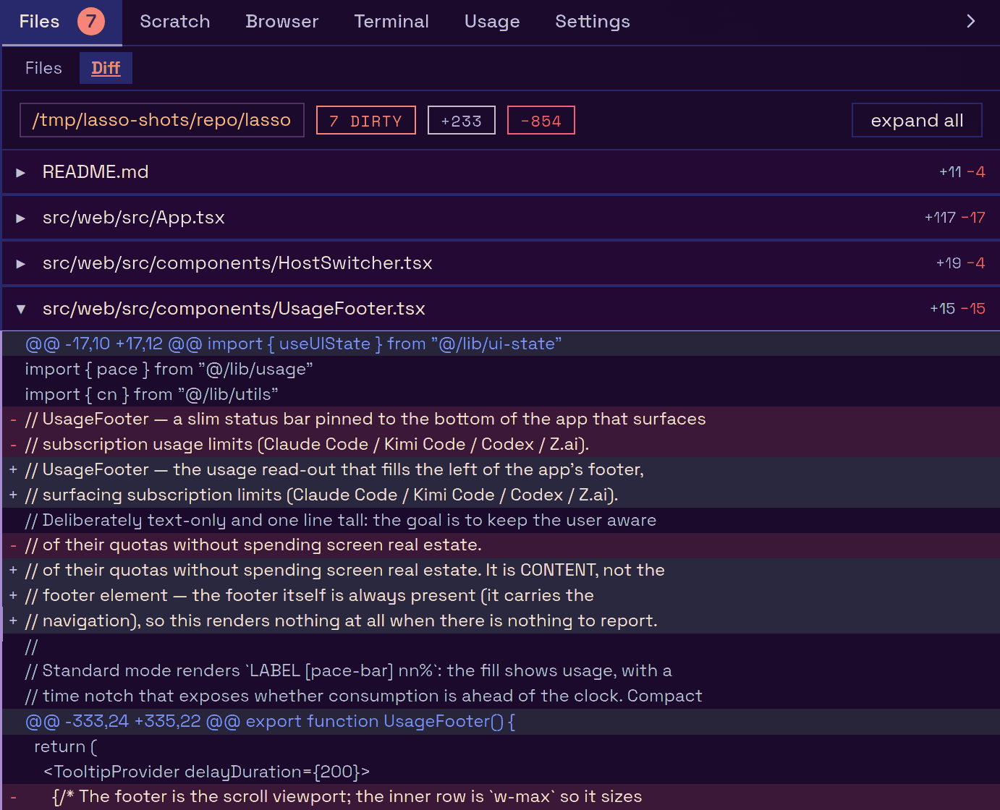
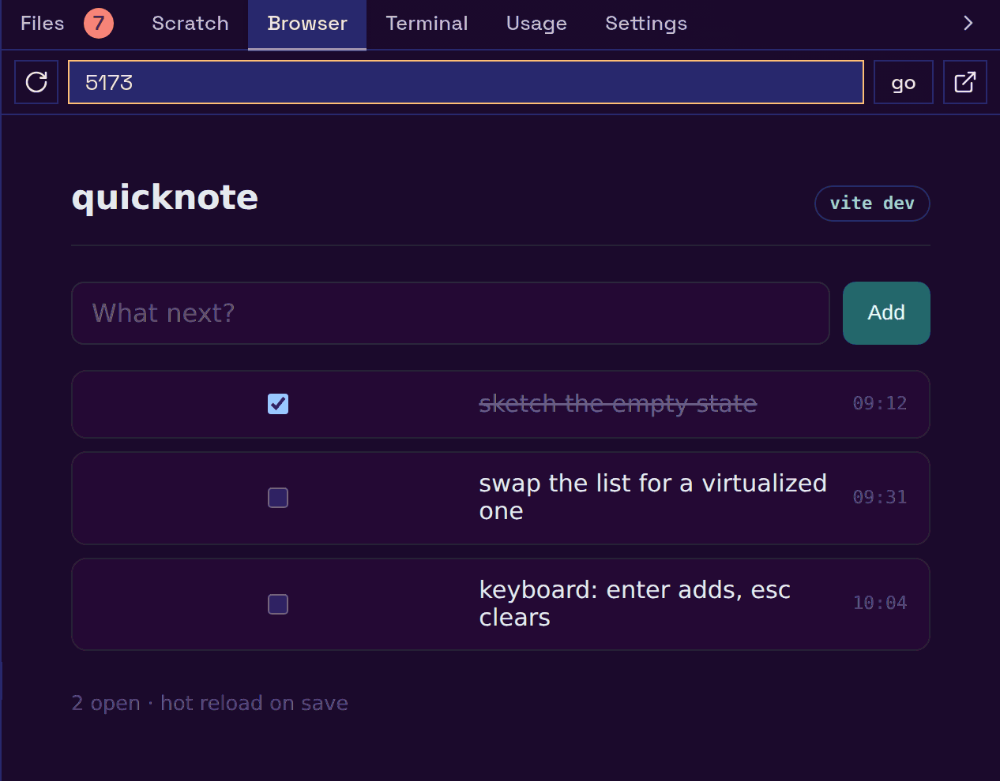
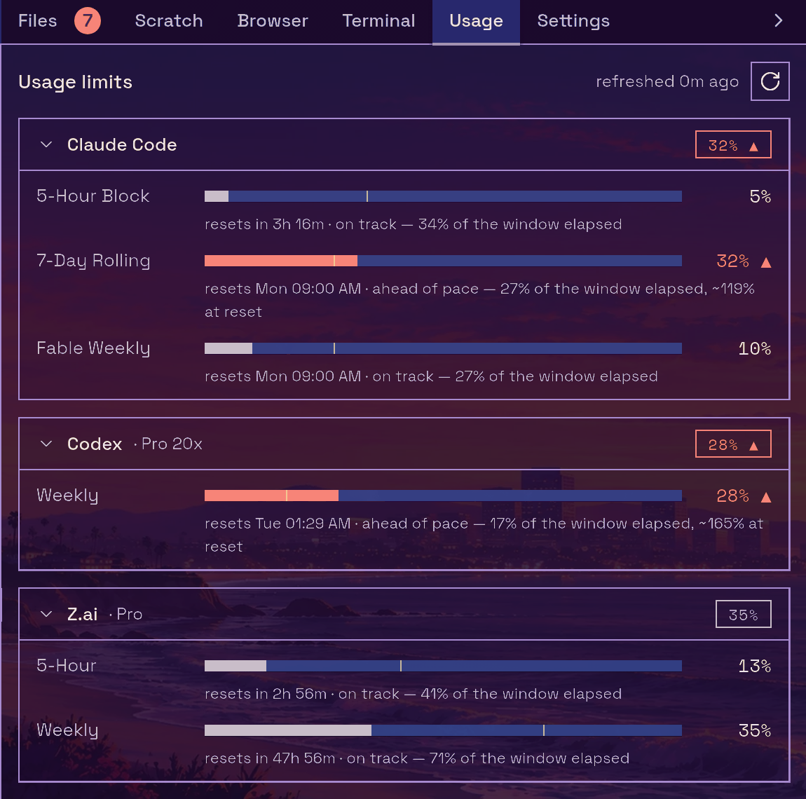
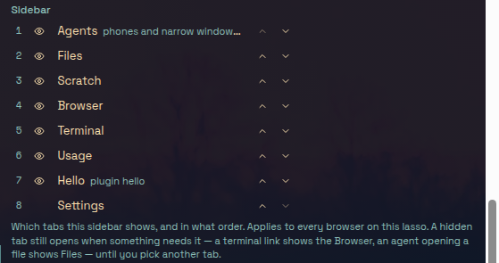

The right-hand sidebar holds lasso's tools. Most of them follow herdr's focused pane: switch to another agent in the terminal and the file tree, the diff and the editor switch with it, onto whichever machine that pane is working on.

The built-in tabs, in their default order:

| Tab | What it is |
| --- | --- |
| **Agents** | Every agent across your hosts. Phones and narrow windows only. |
| **Files** | A file browser, viewer and editor for the focused pane's directory, with a **Diff** view of its git changes. |
| **Scratch** | A notepad you can send to the terminal or save to a file. |
| **Browser** | A shared Chromium your agents can drive, or a plain iframe. |
| **Terminal** | A plain shell outside herdr. See [The Terminal tab](./terminal.md#the-terminal-tab). |
| **Usage** | Every tracked provider's quota windows in full. |
| **Settings** | lasso's settings, in a **General** and a **Themes** pane. |

Enabled [plugins](../plugins/index.md) add their own tabs to the same strip.

`⌘⇧F`, `⌘⇧S` and `⌘⇧B` open the sidebar straight onto Files, Scratch and Browser.

## Files

**Files** is a file tree, a viewer and an editor, rooted at the focused pane's working directory on the machine that pane is actually using. When the pane is an SSH session onto another box, or a herdr machine view, the tree, the viewer and every save go to that other box. See [Hosts](../concepts/hosts.md).

**Following the pane.** The **follow active pane** checkbox in the tab's header keeps the tree on the focused pane's directory. Typing a path into the **go to path…** box (press Enter) stops following, so the tree stays where you put it; tick the checkbox again to jump back to the pane. Each herdr pane keeps its own tree position, open file and expanded folders for the session, so switching agents and back returns you to where you were.

**The tree.**

- Changed files carry their git status letter (`M` modified, `A` added, `U` untracked, `R` renamed), and a folder that contains changes carries a dot.
- The folder-click button beside the path box switches between expanding a folder in place and navigating into it. The choice is saved on the server.
- Right-click a file for **Download**, **Rename…** and **Delete**. Folders offer Rename and Delete.
- Drag files from your desktop onto a folder (or onto empty space for the current root) to upload them there. The upload button in the tab header does the same for the open directory. Uploads are capped at 1 GiB.

**The viewer and editor.** Clicking a file opens it over the tree.

- Text and code open in an editor. Changes are saved only when you press **save** or `⌘S`/`Ctrl-S`; closing with unsaved changes asks first. An unsaved buffer survives switching to another pane and back.
- Markdown opens as a rendered preview (Mermaid diagrams included). The pencil and eye buttons switch between the raw editor and the preview.
- Images (click to zoom), PDFs and videos are shown read-only. They reload on their own when the file changes on disk.
- `Esc` closes the viewer.

**Downloads and HTTPS.** A download is an ordinary link to the file, served with `Content-Disposition: attachment`. Some browsers warn about or block downloads from a plain-HTTP page, so if a download does not arrive, reach lasso over HTTPS (see [Why HTTPS matters](../deployment/index.md#why-https-matters)).

**When an agent opens a file for you.** An agent can put a file or folder in front of you with the `open_file` MCP tool or the `lasso open <path>` command (see [MCP tools](../mcp/tools.md) and [CLI tools for agents](../mcp/cli.md)). Every visible lasso tab reveals the Files tab, opening the sidebar if it is collapsed, and shows the file, scrolled to a line if one was given. A folder re-roots the tree there. If you have unsaved edits open, lasso does not replace them: a notice offers to open the agent's file, and taking it asks before discarding your changes. A tab in the background ignores the request.

### Diff

The **Diff** view sits beside **Files** at the top of the tab. Its label is underlined in the warning colour while the working tree is dirty and shown in the success colour when it is clean.

- While the repository has uncommitted changes, it shows the working tree against `HEAD`.
- Once it is clean, it shows the current branch against its base branch (labelled `vs <base>`), so you can still read what the agent has done on its branch.
- The header shows the directory, the dirty count or "clean", and the total lines added and removed. Each file starts collapsed; expand one to load its hunks, or use **expand all**.
- It follows the focused pane exactly like Files, including onto other hosts.

The Files tab's label carries the same git status badge, and so does the footer's **Sidebar** button while the sidebar is collapsed.

## Scratch

**Scratch** is a persistent notepad, kept in this browser across reloads.

- **Send to Terminal** (`⌘↩`/`Ctrl↩`) types the buffer into the herdr terminal's focused pane without pressing Enter, so you can review it there first.
- **Save** writes the buffer to a file on the focused pane's host. The path defaults to `scratch.txt` in the pane's working directory.
- **Clear** empties it.

## Browser

The **Browser** tab shows a web page beside the terminal, so you can watch a dev server reload while an agent works. Type a bare port (`5173`) or any URL into the address bar. It has two modes, switched with the **Agent** / **Iframe** control in its toolbar:

**Agent** (the default when lasso can find Chromium) is the [shared browser](../concepts/shared-browser.md): a real Chromium running on lasso's machine, streamed into the tab and driven by your mouse, keyboard and touch. Your agents connect to the same Chromium, so you watch the pages they open and they see the pages you open.

- It shows one page at a time; its own tab strip along the top lists the open pages, with a button to open a new one.
- When an agent opens a page for you (lasso's `open_browser_tab` MCP tool), every browser showing lasso switches its Browser tab to Agent mode and that page, and says which agent opened it.
- Any site loads, because it is a real browser rather than a frame, and a bare port means `localhost` on lasso's machine.
- It streams only while the tab is on screen, so an unwatched browser costs nothing and can idle out.
- On a touch device, the keyboard button raises the on-screen keyboard to type into the page.

**Iframe** loads the page directly in your own browser with nothing in between. That keeps it private to you, but your browser's rules apply: an HTTPS lasso cannot frame an `http://` page (mixed content), a lasso reached over a public address cannot frame a private or tailnet address, and many sites refuse to be framed at all. lasso detects each case, explains it, and offers to open the page in a new tab. A bare port means that port on the hostname you reached lasso by.

The mode you pick is saved on the server, so every device opens the same one. Without a Chromium on lasso's machine, the tab uses Iframe and says why.

**Profiles.** In Agent mode, the bar along the bottom of the tab picks the **browser profile**. Each profile is its own Chromium with its own cookies and logins; a dot marks the ones running. The settings button beside it opens **Browser profiles**, where you can create, rename and delete profiles. See [Shared browser](../concepts/shared-browser.md).

**Links from the terminal.** A link clicked in the terminal opens here. It opens in Iframe mode, since a link you click is your own page rather than one to put in front of every agent; the exception is an `http://` link on an HTTPS lasso, which goes to the Agent browser (or a new tab if there is none). `Cmd`/`Ctrl`-click opens a new browser tab instead. The setting is **Settings → General → Terminal & browser → Open terminal links in the sidebar browser**.

## Agents

On a phone or a window narrower than 768 px, the **Agents** tab is the first in the strip. It lists every agent across all connected hosts, ordered so blocked agents come first, as a single column on a phone and two columns where they fit.

- Each tile shows the agent's name, machine, worktree and status.
- The filter matches name, harness, worktree and machine (every word must match).
- Tapping a tile focuses that agent (moving this tab to its host if needed), closes the sidebar, and opens its [chat view](./terminal.md#chat-view).
- The close button on a tile closes that agent's pane after a confirmation. The agent stops; its transcript stays on disk.
- The **+** button in the tab strip opens the New dialog.
- A host that could not be listed is reported at the bottom.

At desktop widths this tab is not shown; the same list is the chat view's docked column.

## Usage

lasso tracks your coding-subscription quotas so you can see a budget running out before an agent stops mid-task. The footer shows a one-line glance; the **Usage** tab shows every window in full.

**Providers.** lasso reads each provider's credentials on lasso's own machine and calls the same usage endpoint the provider's own tools use:

| Provider | Credentials read from |
| --- | --- |
| Claude Code | `~/.claude/.credentials.json` |
| Kimi Code | `$KIMI_CODE_HOME/credentials/kimi-code.json`, else `~/.kimi-code/credentials/kimi-code.json` |
| Codex | `$CODEX_HOME/auth.json`, else `~/.codex/auth.json` |
| Z.ai | `ZAI_API_KEY` or `GLM_API_KEY`; else `~/.config/openusage/zai.json` or `~/.config/zai/key.json`; else a Z.ai-backed Claude Code setup (`ANTHROPIC_BASE_URL` plus `ANTHROPIC_AUTH_TOKEN`/`ANTHROPIC_API_KEY`, in the environment or in `~/.claude/settings.json`) |

A provider with no credentials is hidden automatically. Codex and Kimi tokens that expire are refreshed and written back to their files.

**Reading a window.** Each window (for example Claude Code's **5-Hour Block** and **7-Day Rolling**) has a bar with:

- the fill, which is how much of the quota you have used;
- a **pace notch** at the share of the window that has already elapsed. Usage past the notch means you are burning faster than the clock and will hit the cap before it resets;
- below it, the reset time and the pace: "on track", or "ahead of pace" with a **projection** of where usage lands at reset when the window is far enough along to project (from 10% elapsed). So "28%, ahead of pace, ~165% at reset" tells you a weekly budget will run out before it resets, even though 28% sounds comfortable.

A bar turns to the warning colour at 90% or when ahead of pace, and to the error colour at 100%.

**Refreshing.** The footer and the tab poll every minute, and the tab's refresh button fetches now. lasso caches results for about 25 seconds so several open browsers do not multiply requests. If a provider rate-limits lasso, it backs off for five minutes and keeps showing the last good reading (marked with a warning), which is also saved to disk so a restart does not blank the numbers.

**Configuring it** in **Settings → General → Sidebar & usage → Usage tracking**: tick the providers to track (unticking one stops its requests and token refreshes entirely), order them with the arrows, and choose a **Standard** or **Compact** footer. Compact abbreviates provider names and drops the footer's bars; hover a metric for its full label, reset and pace.

## Settings

Settings has two panes, **General** and **Themes**. Each pane is a list of collapsible groups, all closed by default. A closed group's header summarises what is inside, and anything needing attention (such as a plugin waiting for approval) shows there. Which groups you keep open is remembered per browser.

### General

**Agents**

- **New agents: Auto-title new agents from their prompt.** After an agent is created, lasso asks the first local agent CLI that answers (claude, codex, opencode, omp, pi) to summarise its prompt into a short name. It runs on lasso's machine whichever host the agent is on, and renames only the herdr workspace: the branch and working directory keep their original names. On by default.
- **New agent/terminal host**: the host the New dialog opens on. **Auto (use last used)** picks the host you last created on.
- **Configuring host**: which host's creator settings the fields below edit. Each host keeps them in its own `~/.lasso/lasso.db`; for a remote host lasso edits that file over SSH with the host's `sqlite3`, so lasso itself does not need to be installed there.
- **New Agent defaults**, **New terminal defaults** and **Per-repository setup**: see [The New dialog](./new-agent.md#settings-that-shape-the-dialog).

**Terminal & browser**

- **Open terminal links in the sidebar browser** (on by default). See [Browser](#browser).
- **Shared browser**: whether lasso's Chromium is running, its resource cap and open pages, with **Start**, **Restart** and **Stop**, the browser binary, and any problem that keeps it from running.
- **Browser tab mode**: **Agent** or **Iframe**.
- **Connect an agent**: the `/browser-mcp` URL, a ready-to-paste `claude mcp add` command and the raw CDP endpoint, each with a copy button. See [Browser MCP and CDP](../mcp/browser-mcp.md).

**Notifications**

- **Push notifications to this device** registers this browser for Web Push, for agents that block waiting on you and for agents that call `lasso notify`. Every registered device is listed with the outcome of its last push, and **Send a test notification** checks the whole path. The group explains when the browser cannot do push (it needs HTTPS or localhost) or when iOS needs the app added to the Home Screen first. See [Notifications](../concepts/notifications.md).

**Sidebar & usage**

- **Sidebar**: arrange and hide tabs, see [below](#arranging-and-hiding-tabs).
- **Usage tracking**: see [Usage](#usage).

**Plugins**

Installs, previews, enables, disables, trusts, updates, unlinks and uninstalls plugins, switches each one's MCP server between a container and a VM, restarts those servers and shows their logs. It shows which isb lasso found, or why plugin sandboxes are unavailable. See [Plugins](../plugins/index.md).

**Getting started: Take the tour** replays the [first-run tour](./index.md#the-first-run-tour).

### Themes

**Appearance**, **Background**, **Typography**, **Install a theme** and **Fleet sync**. All of it is described in [Theming](./theming.md).

## Arranging and hiding tabs

**Settings → General → Sidebar & usage → Sidebar** lists every tab, the built-ins and each enabled plugin's, with a visibility toggle and up/down arrows. **Reset** restores the default order.

- The arrangement is saved on the server and applies to every browser on this lasso.
- **Settings** cannot be hidden, since it is where you un-hide everything else.
- A hidden tab still opens when something needs it: an agent opening a file shows Files, and a terminal link shows Browser. It stays in the strip until you pick another tab.
- A plugin that is disabled for a while keeps its place, and comes back where it was when re-enabled. A new plugin's tab lands just before Settings.
- **Agents** is shown only on phones and narrow windows wherever you put it.
